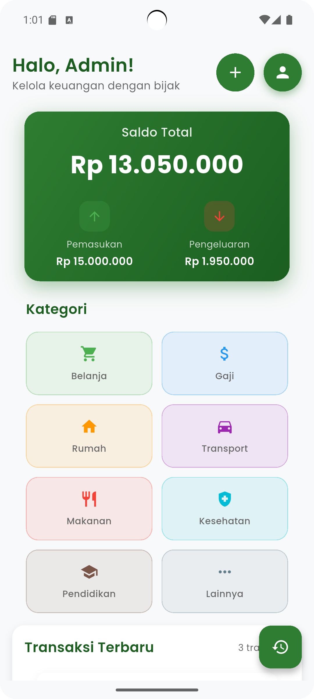

# 📊 Hitungan App

<p align="center">


</p>

**Hitungan App** adalah aplikasi Flutter sederhana untuk melakukan **perhitungan matematika dasar**.
Aplikasi ini dibuat menggunakan **Flutter dan Dart** serta mendukung berbagai platform.

🚀 **Supported Platforms**

* 🌐 Web
* 📱 Android
* 💻 Windows
* 🐧 Linux
* 🍎 macOS
* 📱 iOS

---

# ✨ Features

* ➕ Perhitungan matematika dasar
* ⚡ Dibangun dengan **Flutter & Dart**
* 🌍 **Multi-platform support**
* 🔥 **Hot Reload** untuk development cepat
* 🧩 Struktur project Flutter standar

---

## 📸 App Preview



📱 Calculator UI
📊 Simple math calculation

---

# 🛠 Installation

### 1 Install Flutter

Download Flutter:

[https://docs.flutter.dev/get-started/install](https://docs.flutter.dev/get-started/install)

---

### 2 Check Environment

Pastikan Flutter sudah siap.

```
flutter doctor
```

---

### 3 Clone Repository

```
git clone https://github.com/username/hitungan_app.git
cd hitungan_app
```

---

# ▶ Run Application

### 🌐 Web

```
flutter run -d chrome
```

### 💻 Windows

```
flutter run -d windows
```

### 📱 Android

```
flutter run -d android
```

---

# 📁 Project Structure

```
hitungan_app/

lib/
 └── main.dart

android/
ios/
web/
windows/
linux/
macos/

pubspec.yaml
```

---

# 🔄 Development

Flutter menyediakan **Hot Reload** untuk mempercepat development.

| Command | Function    |
| ------- | ----------- |
| r       | Hot Reload  |
| R       | Hot Restart |

---

# 📦 Dependencies

Menambahkan dependency:

```
flutter pub add nama_package
```

Update dependency:

```
flutter pub get
```

---

# 🤝 Contributing

Kontribusi sangat terbuka.

Langkah kontribusi:

1 Fork repository
2 Buat branch baru
3 Commit perubahan
4 Buat Pull Request

---

# 📄 License

MIT License

Copyright (c) 2026 Movic

Permission is hereby granted, free of charge, to any person obtaining a copy
of this software and associated documentation files (the "Software"), to deal
in the Software without restriction, including without limitation the rights
to use, copy, modify, merge, publish, distribute, sublicense, and/or sell
copies of the Software, and to permit persons to whom the Software is
furnished to do so, subject to the following conditions:

The above copyright notice and this permission notice shall be included in all
copies or substantial portions of the Software.

THE SOFTWARE IS PROVIDED "AS IS", WITHOUT WARRANTY OF ANY KIND, EXPRESS OR
IMPLIED, INCLUDING BUT NOT LIMITED TO THE WARRANTIES OF MERCHANTABILITY,
FITNESS FOR A PARTICULAR PURPOSE AND NONINFRINGEMENT. IN NO EVENT SHALL THE
AUTHORS OR COPYRIGHT HOLDERS BE LIABLE FOR ANY CLAIM, DAMAGES OR OTHER
LIABILITY, WHETHER IN AN ACTION OF CONTRACT, TORT OR OTHERWISE, ARISING FROM,
OUT OF OR IN CONNECTION WITH THE SOFTWARE OR THE USE OR OTHER DEALINGS IN THE
SOFTWARE.

---

💙 Built with Flutter


